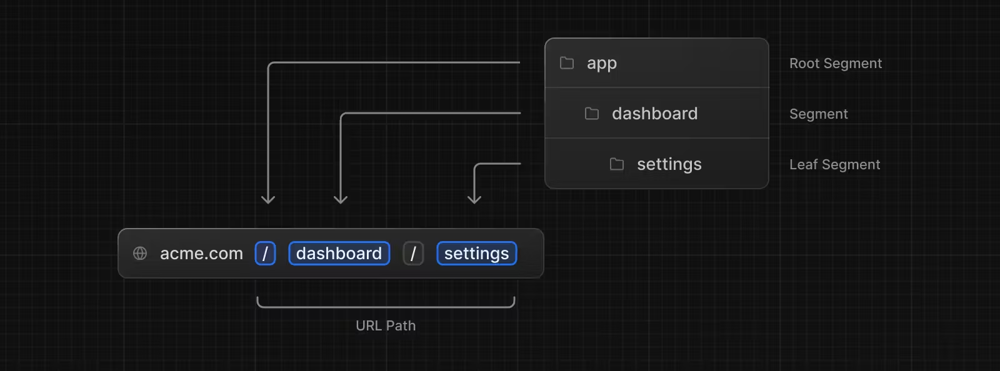

# Next JS

NextJS est un frameword React qui permet de creer des applications web. L'interface se compose de composants React et le framework se charge d'apporter tous les outils de bundling, compilation et bien plus...

## Principales fonctionnalités

- Système de routage : NextJS utilise un système de routage directement basé sur le système de fichiers.
- Rendu performant : NextJS permet de faire du rendu server (Server Side Rendering) et du rendu statique (Static Site Generation).
- Data Fetching : NextJS facilite l'utilisation d'async await pour faire des appels API.
- CSS : NextJS permet d'utiliser CSS, Saas, Less, Stylus, CSS Modules, Styled Components et bien plus...
- TypeScript : Next.JS permet d'utiliser TypeScript.

## Installation

- Pre requis : NodeJS 18.17 ou plus 
- Compte GitHub 
- Compte vercel

## Création d'un projet

Pour créer un projet NextJS, il suffit d'executer la commande suivante :

```bash
npx create-next-app
```
Ensuite repondre : 

Le nom de l'app
TypeScript : Oui
ESLint : Oui
Tailwind CSS : Oui
src /directory : Oui
import alias : (très utile aparamant mais ici on repond non)

## Structure d'un projet NextJS

tsconfig.json : fichier de configuration TypeScript

src/app : contient les composants de l'application

tous ce qui est destiné a être une page doit être dans le dossier app

pages.tsx / layout.tsx 

Chaque dossier correspond a une url 



En gros Layout c'est le fichier qui va contenir le header et le footer de notre site par exemeple 
au lieu de faire un component header et footer on met tous dans le layout et on l'importe dans les pages

MAIS si on veut un autre header par exemple il faut faire un autre layout dans le dossier en question

## Routing de base avec NextJS

Le routing de base avec NextJS est très simple. Il suffit de créer un fichier dans le dossier pages avec le nom de la route. Par exemple, pour créer une page qui s'appelle "about", il suffit de créer un fichier about.tsx dans le dossier pages.

Vocabulaire du système de routing : 

- Tree : Un arbre est une structure de données qui représente une hiérarchie. Dans le cas de NextJS, l'aborésence des fichiers dans le dossier pages représente la hiérarchie des routes.

- Subtree : Un sous arbre qui fait partie d'un arbre plus grand. Dans NextJS un sous arbre est un dossier qui fait partie de l'arborecence des fichiers dans le dossier pages.

- Root : La racine de l'arbre. Dans NextJS, le dossier pages est la racine de l'arboréscence des fichiers.

- Leaf : Une feuille est un noeud qui n'a pas d'enfant. Dans NextJS, une feuille est un fichier qui n'a pas de sous dossier.


La présence du dossier pages est obligatoire. Si on supprime ce dossiers on empecche le bon fonctionnement du routeur.

Par défaut tous les composant situé dans le dossier app sont des `React Server Component`

En résumé : 

- Les dossiers permettent de définir les routes
- Les fichiers permettent de représenter l'UI

Il existe tout un systeme de nomenclature des fichiers et de conventions afin d'assurer le bon fonctionnement du router.

- layout : permet de définir une UI commune pour plusieurs pages
- page : l'ui qui correspond a une route spécifique
- loading : la page de chargement commune a un segment et ses enfants
- error : ui qui correspond a une erreur
- not-found : ui qui correspond a une page non trouvée

## Navigation entre les pages

- Link : permet de naviguer entre les pages sans recharger la page

```ts
import Link from 'next/link'

export default function Home() {
  return (
    <div>
      <Link href="/about">
        <a>About</a>
      </Link>
    </div>
  )
}
```

Link est un composant fourni par Next.

- Le hook useRouter : permet de naviguer depuis un composant client par le code (l'usage de hook requiert l'utilisation de la directive `useClient`)

- Il existe un hook tres utile qui permet de verifier quel est le chemin actuel de l'application pathname

## Grouper les routes

Dans un dossier App, les dossiers correspondent a des routes. Cependant, on peut empecher le focntionnement en placant le nom d'un dossier entre parentheses. Par exemple, si on veut que le dossier `blog` ne soit pas une route, il suffit de le renommer en (blog).

On poura ainsi organiser les portions de route de façon logique sans impacter l'URL.

Il faut faire attention a ce que deux fichiers page situes page dans des dossiers different ne soient pas accessible par la meme route.

```
app/(test)/users/page.tsx
app/(test2)/users/page.tsx
```

## Les routes dynamique

Une route dynamique est créee en placant des crochets autour d'un segment de route. Par exemple, pour créer un route dynamique a l'adresse `/users/{id}/.../page.tsx`

Les informations des routes dynamiques sont passe en props en composant page : params

```tsx
export default function Page({ params}) : { id: string } {
  return <div> Current user : {params.id} </div>;
  }
```

Pour aller plus loin, il existe une fonction appelee `generaeStaticParams` qui permet de generer les routes dynamiques de facon statique (au moment du build).

## Le segment catch-all

Les segments dynamique peuvent etre etendus avec le segment catch-all. Le segment catch-all est represente par trois points `...`. Il permet de recuperer tous les segments restants de l'URL. : [...foldername]

Route : 

```

app/shop/[...slug]/page.tsx
/shop/a
param : { slug: ['a'] }

app/shop/[...slug]/page.tsx
/shop/a/b
param : { slug: ['a', 'b'] }

app/shop/[...slug]/page.tsx
/shop/a/b/c
param : { slug: ['a', 'b', 'c'] }

```

## Le catch all optionnel

Le catch all peut etre rendu optionnel en le placant entre parentheses : [...slug]. cela permet de faire des routes comme 'shop' et 'shop/a/b/c' avec le meme fichier page.

```ts
export default function Page({ params } : { params: ( slug?: string[])}){
    return <div> Current user : {params.slug}</div>;
}
```

## La gestion des chargements 

On peut créer une interface utilisateur de chargement pour les routes dynamiques en créant un fichier `loading.tsx` dans le dossier pages. Ce fichier sera utilisé pour toutes les routes dynamiques.

Ce système fonctionne avec React Suspense : https://fr.reactjs.org/docs/concurrent-mode-suspense.html

```tsx
export default function Loading() {
  return <div>Loading...</div>;
}
```

## La gestion des erreurs

On peut créer une interface utilisateur de chargement pour les routes dynamiques en créant un fichier `error.tsx` dans le dossier pages. Ce fichier sera utilisé pour toutes les routes dynamiques.

Ce système fonctionne avec React Suspense : https://fr.reactjs.org/docs/concurrent-mode-suspense.html

```tsx
export default function Error() {
  return <div>Error...</div>;
}
```