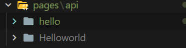
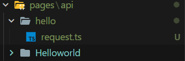
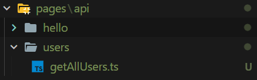
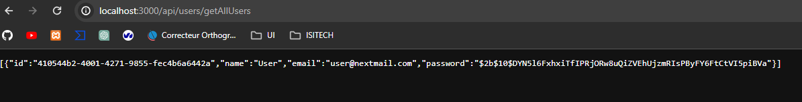
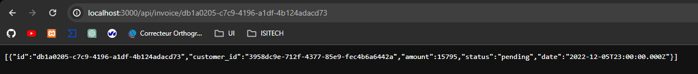

## API AVEC NEXT JS

### Base de l'API
Après avoir setup un projet sur Next JS, pour faire une API, il faut créer un dossier pages a la racine du projet, puis créer un dossier API dans le dossier pages.



Dans ce dossier API, on peut créer des fichiers .ts qui vont être des routes de notre API.



Apres avoir lancer le projet avec 
```bash
pnpm run dev
```

On peut accéder a notre API avec l'url suivante : `http://localhost:3000/api/hello/request`

Analysons le code de [request.ts](pages/api/hello/request.ts)

```typescript	
import type { NextApiRequest, NextApiResponse } from 'next'
```
Ici on importe les paquet NextApiRequest et NextApiResponse de next, qui vont nous permettre de faire une API.

```typescript
type Data = {
  name: string
}
```

On crée un type Data qui va contenir un objet avec une clé name de type string.

C'est dans data que nous allons stocker les données que nous allons renvoyer dans chaque requete.

```typescript
export default function handler(
  req: NextApiRequest,
  res: NextApiResponse<ResponseData>
) {
  res.status(200).json({ message: 'Hello from Next.js!' })
}
```

On exporte une fonction handler qui prend en parametre une requete et une reponse.

La requete est de type NextApiRequest et la reponse est de type NextApiResponse (paquet de next importé plus haut).

Dans cette fonction, on renvoie une reponse avec un status 200 (qui signifie que tout s'est bien passé) et un objet json qui contient un objet avec une clé name et une valeur Hello from Next.js!.

On peut aussi renvoyer un status 404 si la ressource n'est pas trouvée.

### Allez plus loin

(Mon projet est le tutoriel de Next JS, je suis donc déja connecté a une base de donnée Postgres)

Pour aller plus loin, on peut créer une route qui va nous permettre de récupérer des données de la base de donnée.

On va donc faire un nouveau dossier users qui va contenir un fichier getAllUsers.ts



Le fichier `getAllUsers.ts` va nous permettre de récupérer tous les utilisateurs de la base de donnée.

Mais pour cela il faut configurer une requete SQL qui permet de récupérer tous les utilisateurs.

Dans le fichier `app/lib/data.ts` on va créer une fonction `getAllUsers`.

```typescript
export async function getAllUsers() {
  try {
    const users = await sql`SELECT * FROM users`;
    return users.rows as User[];
  } catch (error) {
    console.error('Failed to fetch users:', error);
    throw new Error('Failed to fetch users.');
  }
}
```

Puis dans le fichier `pages/api/users/getAllUsers.ts` on va importer la fonction `getAllUsers` et l'utiliser dans la fonction `handler`.

```typescript
import type { NextApiRequest, NextApiResponse } from 'next'
import { getAllUsers } from '@/app/lib/data';
```

puis dans la fonction `handler` on va utiliser la fonction `getAllUsers` et renvoyer les données récupérées.

```typescript
  export default async function handler(
    req: NextApiRequest,
    res: NextApiResponse
  ) {
    const users = await getAllUsers();
    res.status(200).json(users);
  }
```

On peut maintenant accéder a la route `http://localhost:3000/api/users/getAllUsers` et récupérer les données de la base de donnée.



## Route dynamique 

On peut aussi créer des routes dynamiques, pour cela on va créer un fichier `[id].ts` dans un dossier invoice.

et on va créer une fonction `getInvoiceById` dans le fichier `app/lib/data.ts` qui va nous permettre de récupérer une facture en fonction de son id.

```typescript
export async function getAllInvoiceById(id: string) {
  try {
    const invoices = await sql`SELECT * FROM invoices WHERE id=${id}`;
    return invoices.rows as InvoiceForm[];
  } catch (error) {
    console.error('Failed to fetch invoices:', error);
    throw new Error('Failed to fetch invoices.');
  }
}
```

Puis dans le fichier `[id].ts` on va importer la fonction `getInvoiceById` et l'utiliser dans la fonction `handler`.

```typescript
import { NextApiRequest, NextApiResponse } from 'next';
import { getAllInvoiceById } from '@/app/lib/data';

export default async function handler(req: NextApiRequest, res: NextApiResponse) {
  const { id } = req.query;

  if (!id) {
    return res.status(400).json({ error: 'Missing user ID' });
  }

  try {
    const invoice = await getAllInvoiceById(id as string);
    if (!invoice) {
      return res.status(404).json({ error: 'Invoice not found' });
    }
    return res.status(200).json(invoice);
  } catch (error) {
    return res.status(500).json({ error: 'An error occurred while fetching the invoice' });
  }
}
```

On peut maintenant accéder a la route `http://localhost:3000/api/invoice/[preciser ici l'id de la facture]` et récupérer la facture avec l'id x.

