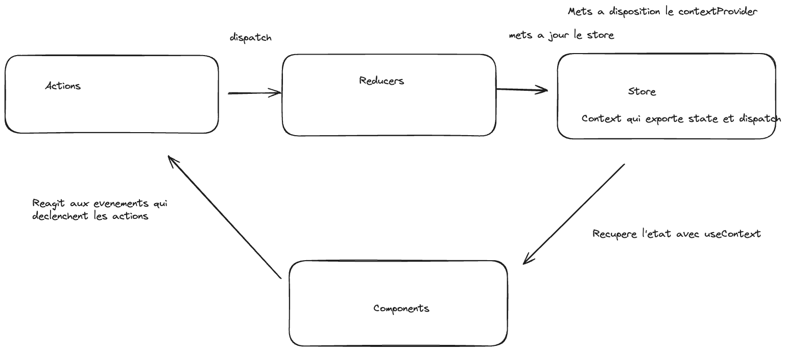

# REACTJS / NEXTJS

## Introduction

React est une bibliothèque JS qui permet de creer facilement des interfaces utilisateurs. Elle est maintenue par Facebook et une communauté de développeurs indépendants.

## Installation

```
npm crearte vite@latest my-react-app --template react
```

Pour lancez le serveur de dev

```

cd my-react-app

npm install -g

npm run dev

```

`Vite est un outil de build qui permet de faire du hot reload, il est plus rapide que webpack.`

 `Eslint est un outil qui permet de vérifier la syntaxe du code.`

Quand on charge un projet React on execute une fois le code JS et ensuite on ne fait que modifier le DOM. C'est ce qu'on appelle le `client side rendering` contrairement au `server side rendering` qui consiste à executer le code JS à chaque fois qu'on charge une page par exemple avec PHP.

Dossier src : contient le code source de l'application.

Main.jsx est le point d'entrée de l'application.

DOM : Document Object Model : c'est une interface de programmation qui permet de manipuler le contenu d'une page HTML.

JSX : Javascript XML : c'est une extension de la syntaxe JS qui permet d'écrire du HTML dans du JS.

Fonction render : est une fonction qui permet de rendre un composant React dans le DOM.

Chaque balise HTML est un composant React par exemple 
```html
<App>
``` 
est un composant React.

children : est une propriété qui permet de récupérer le contenu d'un composant React.

# Hooks

Les hooks sont des fonctions qui permettent d'ajouter des fonctionnalités à un composant React.

useState : est un hook qui permet de gérer l'état d'un composant React.

useEffect : est un hook qui permet d'effectuer des effets de bord dans un composant React.
un effet de bord est une action qui modifie l'état de l'application.

useRef : est un hook qui permet de créer une référence vers un élément du DOM.

## Correction du TP2 : 

useEffect : Hook qui sert a 2 chose

permet d'éffectuer des actions dans le cycle de vie d'un composant React
exemple : 
```js
useEffect(() => {
    console.log('useEffect');
    document.title = 'New Title';
  });
```
ici on change le titre de la page a chaque fois que le composant est rendu.

Hook prend 2 arguments :

1er argument : une fonction qui sera executer a chaque fois que le composant est rendu.

2eme argument : un tableau de dépendances qui permet de spécifier quand la fonction doit être executer.

exemple : 
```js
useEffect(() => {
    console.log('useEffect');
    document.title = 'New Title';
  }, [title]);
```
useEffect se lance au premier rendu du composant et ensuite a chaque fois que la variable title change. 

Return et cleanup : 

```js
useEffect(() => {
    console.log('useEffect');
    document.title = 'New Title';
    return () => {
      console.log('Cleanup');
    };
  }, [title]);
```
Le cleanup s'exécute avant chaque nouveau rendu du composant, et non pas avant chaque mise à jour de l'état du composant (quand le composant est rendu à nouveau).

SetTimeout : 

```js
useEffect(() => {
    console.log('useEffect');
    document.title = 'New Title';
    const timer = setTimeout(() => {
      alert('Saved data to cloud!');
    }, 1000);
    return () => {
      clearTimeout(timer);
      console.log('Cleanup');
    };
  }, [title]);
```
Ici on utilise clearTimeout pour nettoyer le timeout si les dépendances changent avant que le timeout soit terminé.

L'usage principale de useEffect est quand on veut faire des side effects (effets de bord) dans un composant React.

Un side effect est quelque chose qui peut influé sur l'état de l'application mais qui est externe au composant React comme par exemple une requête HTTP.

useReducer : est un hook qui permet de gérer l'état d'un composant React.

Un prodiver est un composant React qui permet de fournir des données à ses composants enfants.

Par exemple faire un provider authcontext qui permet de fournir des données d'authentification à ses composants enfants.

par la suite il suffit juste d'importer le contexte dans le composant enfant et d'utiliser le hook useContext pour récupérer les données du contexte

